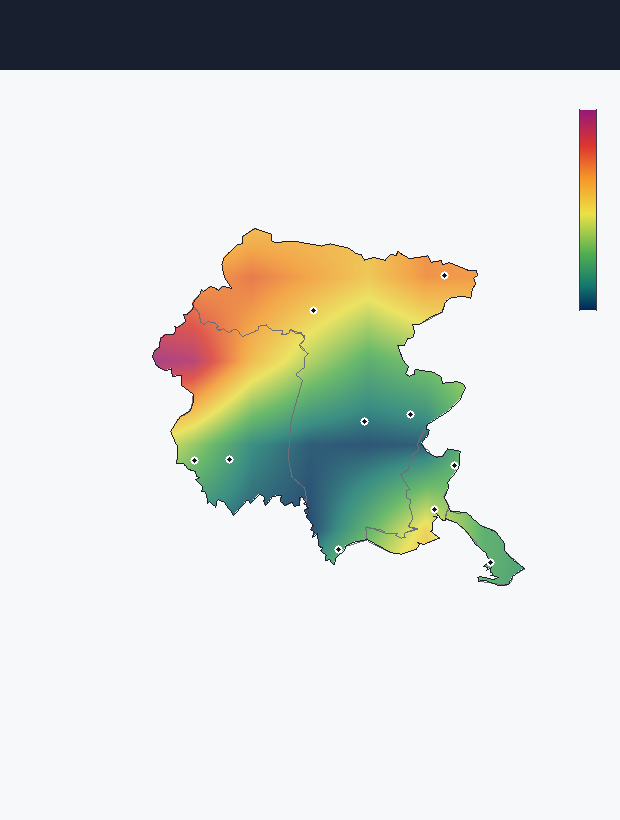

# FVG GRIB Monitor

Lettore **GRIB2** per il **Friuli Venezia Giulia**, scritto in **C++ per Windows**
(Win32 + GDI+, nessuna dipendenza esterna). Legge i file tipo `FVG_CAPE_*.grib2`
e li disegna sopra una mappa del FVG, con colori sfumati (niente quadrati netti),
confini, province e le principali città.



*Anteprima reale del campo CAPE del file di esempio, interpolato e ritagliato
sul confine regionale (generata dallo stesso codice di rendering dell'app).*

---

## Cosa fa

1. **Form con tutte le opzioni di lettura** disponibili nel file. Il file di
   esempio contiene 5 campi e l'app li espone tutti, più le viste "vento":
   - `CAPE (superficie)` — energia convettiva (0–1147 J/kg nell'esempio)
   - `Vento U @ 500 hPa`, `Vento V @ 500 hPa`
   - `Vento U @ 10 m`, `Vento V @ 10 m`
   - `Vento @ 500 hPa (vel.+dir.)` e `Vento @ 10 m (vel.+dir.)` — velocità in
     colore + **frecce** di direzione, calcolate da U/V.
2. **Sfondo del Friuli Venezia Giulia**: confine regionale, confini delle 4
   province (UD, GO, TS, PN) e le città (Udine, Trieste, Pordenone, Gorizia,
   Tolmezzo, Tarvisio, Cividale, Monfalcone, Sacile, Lignano) — appena visibili,
   con i colori del GRIB sopra.
3. **Colori che sfumano** ("scemano via"): i valori della griglia 9×9 vengono
   interpolati bilinearmente su ogni pixel, quindi il rosso passa gradualmente
   all'arancio, al giallo, al verde… come nella realtà. Puoi anche tornare ai
   "quadrati" grezzi togliendo la spunta **Sfumatura morbida**.
4. **Scarica ultimo GRIB**: scarica l'ultima versione del file dall'URL che
   imposti in `config.ini` e lo ricarica al volo.
5. **Controlla aggiornamenti**: confronta la versione dell'app con l'ultima
   *Release* del repo GitHub e, se ce n'è una nuova, apre la pagina di download.

Opzioni nel pannello: mostra città, mostra confini, frecce vento, sfumatura
morbida, **ritaglia sul FVG** (colora solo dentro il confine regionale) e uno
slider per l'**opacità** dei colori.

---

## Compilare (Windows)

Ti serve **uno** tra Visual Studio (Desktop C++) o MinGW-w64. Poi:

### Modo più facile
Doppio-click su **`build.bat`**. Rileva da solo il compilatore, crea
`FVG-GribMonitor.exe` e ci mette accanto `config.ini` e il file di esempio.

> Con Visual Studio: apri prima il *"x64 Native Tools Command Prompt for VS"* e
> lancia `build.bat` da lì (così `cl.exe` è nel PATH).

### Con CMake
```bat
cmake -B build -A x64
cmake --build build --config Release
```
L'eseguibile finisce in `build\Release\FVG-GribMonitor.exe`.

### Verifica del parser (facoltativa, multipiattaforma)
Il decoder GRIB2 è isolato e testabile anche fuori da Windows:
```sh
g++ -std=c++17 src/grib2.cpp test/test_grib.cpp -o t
./t test/sample_FVG_CAPE.grib2
```

---

## Configurazione — `config.ini`

Il file sta **accanto all'eseguibile**:

```ini
[grib]
# URL del pulsante "Scarica ultimo GRIB". Vuoto = il pulsante ricorda di impostarlo.
grib_url =

[update]
# Repo controllato da "Controlla aggiornamenti"
update_owner = gmy77
update_repo  = sismo-echo
```

Quando avrai un endpoint che genera l'estratto FVG (es. un worker Cloudflare),
incolla lì l'URL e il download funzionerà.

---

## Rilasci automatici (auto-update)

La CI (`.github/workflows/fvg-gribmonitor.yml`) compila l'`.exe` su un runner
Windows a ogni push. Per pubblicare una versione scaricabile dal pulsante
"Controlla aggiornamenti", crea un tag:

```sh
git tag fvg-v1.0.1
git push origin fvg-v1.0.1
```

La CI costruisce l'app e crea la **Release**; l'app legge
`api.github.com/repos/<owner>/<repo>/releases/latest` e confronta il numero di
versione (in `app.cpp`, `APP_VERSION`).

---

## Com'è fatto (per chi vuole metterci mano)

| File | Ruolo |
|------|-------|
| `src/grib2.{h,cpp}` | Parser GRIB2 portabile (sezioni 1/3/4/5/6/7, packing semplice, griglia lat/lon). Decodifica + `sampleBilinear`. |
| `src/colormap.h` | Palette a gradiente (CAPE, vento, divergente) con interpolazione lineare. |
| `src/fvg_geo_data.h` | Confini FVG + province + città (da openpolis/geojson-italy, ISTAT, semplificati). |
| `src/net.{h,cpp}` | Download HTTPS e controllo Release GitHub (WinHTTP). |
| `src/app.cpp` | GUI Win32 + GDI+: form, mappa, rendering, frecce, legenda. |
| `test/test_grib.cpp` | Test del parser sui valori noti del file di esempio. |

### Il formato del file di esempio
- Centro emittente 7 (NCEP/GFS), edizione GRIB2.
- Griglia regolare lat/lon **9×9**, passo **0.25°**, estensione **lon 12–14 °E,
  lat 45–47 °N** (riquadro attorno al FVG).
- 5 messaggi: CAPE, U/V a 500 hPa, U/V a 10 m.

---

## Licenza
Vedi `LICENSE` nella root del repository. Dati geografici: openpolis/geojson-italy
(confini amministrativi ISTAT).
