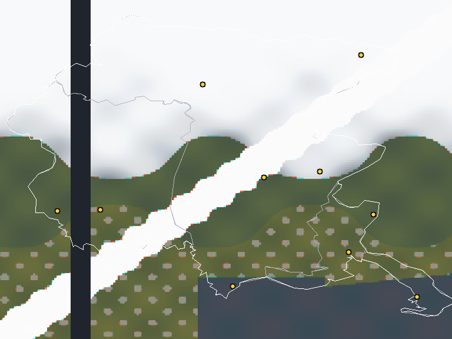

# MODIS FVG Viewer

Visualizzatore **MODIS** (Terra/Aqua) per il **Friuli Venezia Giulia**, scritto
in **C++ per Windows** — Win32 + GDI+, **zero dipendenze esterne**: niente GDAL,
niente HDF, niente ffmpeg. Legge granuli in formato semplice `.mgr`, scarica
immagini **MODIS reali** da **NASA GIBS**, le tiene in una **cache su disco**,
compone canali in RGB naturale calibrato, e monta una sequenza in **timelapse
MP4** (Media Foundation).



*Anteprima generata dallo stesso codice di rendering dell'app (composito naturale
bande 1-4-3, calibrato) sul granulo di esempio: pianura verde, nuvola diagonale,
Adriatico, lo "swath gap" no-data a sinistra, confini e città FVG.*

---

## Cosa fa

1. **Due sorgenti, stesso viewer**
   - **File `.mgr`** — granulo MODIS semplificato e autocontenuto (vedi
     [docs/MFVG-FORMAT.md](docs/MFVG-FORMAT.md)): più bande a risoluzioni miste
     (250/500/1000 m), valori scalati MODIS-style, no-data, data/ora e bbox.
   - **MODIS reale via NASA GIBS** — scegli **Terra/Aqua**, il **prodotto**
     (true-color, bande 7-2-1, bande 3-6-7 neve/ghiaccio, LST temperatura) e la
     **data**: l'app scarica l'immagine reale già georeferenziata, ritagliata sul
     bbox FVG, e la mostra. Scaricare in giorni diversi costruisce una sequenza.

2. **Cache su disco** — ogni immagine GIBS scaricata finisce in `cache\` accanto
   all'eseguibile e viene **ricaricata all'avvio**: costruisci una libreria di
   immagini reali da riusare e confrontare, senza ri-scaricare.

3. **Canali / bande** — lista bande con selezione, e **composito RGB false-color**
   con tre menu. Il colore usa la curva di enhancement **NASA Rapid Response** su
   **riflettanza assoluta**, così l'immagine è naturale e **ben calibrata** e le
   immagini di date diverse sono confrontabili. Default = naturale (1-4-3).
   **Tutto si applica da solo**: clicchi una banda e compare (uscendo
   dall'RGB), cambi prodotto o satellite e l'immagine si aggiorna subito —
   istantanea se è già in cache, scaricata in silenzio altrimenti.

3b. **Nitidezza** — spunta **"Nitidezza (unsharp)"** (attiva di default): una
   maschera di contrasto che restituisce il dettaglio di bordo perso
   nell'interpolazione. Per immagini davvero fini, vedi *Risoluzione* più sotto.

4. **Interazione mappa** — **pan** con trascinamento del mouse, **zoom** con la
   rotellina **centrato sul cursore**, **Reset vista** (fit-to-window). Overlay
   opzionali: **confini** regionali/provinciali FVG e **città** (Udine, Trieste,
   Gorizia, Pordenone, …) con etichetta.

5. **Confronto differenze** — spunta **"Diff vs precedente"** per vedere in canvas
   il `|corrente − precedente|` (amplificato) tra due granuli della sequenza.

5b. **Modalità blocco** — spunta **"Blocco: FVG → equatore"** per chiedere, sullo
   stesso passaggio che sorvola il FVG, una **fascia verticale** dal parallelo
   del FVG giù fino all'**equatore** (≈24° di longitudine, quanto uno swath
   MODIS). Vale per Terra e Aqua; i confini FVG restano disegnati, così si vede
   a colpo d'occhio dove siamo nella colonna. Le immagini "blocco" hanno una loro
   cache separata (`strip_*.png`).

6. **Sequenza + timelapse** — filmstrip in basso con le miniature ordinate per
   data/ora, cliccabili. **"Genera filmato"** monta la sequenza in **MP4 H.264**
   (Media Foundation, nativo), con **frame rate** configurabile.

7. **Status bar** — coordinate **lat/lon** sotto il cursore, **valore** del pixel
   (per le bande locali), prodotto/satellite, data/ora, livello di zoom.

8. **UI** — finestra ridimensionabile, canvas ampio (≥70%), **Mica** backdrop e
   **dark/light** automatico dal tema di sistema (Windows 11 22H2+; sui sistemi
   più vecchi gli attributi DWM vengono ignorati senza errori).

Gestione errori esplicita: se un granulo **non copre il FVG** o il file HDF non è
leggibile, l'app **avvisa** invece di crashare; il download GIBS di un giorno
senza copertura viene segnalato con un suggerimento (prova un'altra data).

---

## Compilare (Windows)

Ti serve **uno** tra Visual Studio (Desktop C++) o MinGW-w64.

### Modo più facile
Doppio-click su **`build.bat`**, da un prompt qualsiasi. Crea
`MODIS-FVG-Viewer.exe` e ci mette accanto i 3 granuli di esempio.

**Non serve** aprire il *"x64 Native Tools Command Prompt"*: lo script cerca il
compilatore da solo, in quest'ordine —

1. `cl.exe` / `g++.exe` già nel `PATH`;
2. **Visual Studio** individuato con `vswhere` (installato con qualsiasi VS
   2017+), di cui carica `vcvars64.bat`. È il caso più comune di "nessun
   compilatore trovato": VS c'è, ma `cl.exe` entra nel `PATH` solo dentro il
   suo prompt dedicato;
3. **MinGW-w64** nelle posizioni note (MSYS2 `C:\msys64`, chocolatey, i
   pacchetti portabili di winget, `C:\mingw64`).

### Non hai nessun compilatore?
Doppio-click su **`setup-compiler.bat`**: installa **MSYS2 + MinGW-w64** via
`winget` e compila. Va in `C:\msys64`, un percorso noto — così non dipende dal
`PATH`, che winget aggiorna per le finestre nuove ma non per quella in corso.
Non tocca un'eventuale installazione di Visual Studio.

### Se ancora non compila
Doppio-click su **`check-compiler.bat`**: non installa e non modifica nulla,
elenca cosa c'è sulla macchina (compilatori nel `PATH`, installazioni VS e se
hanno il workload C++, MinGW nelle posizioni note) e dice cosa manca.

### Con CMake
```bat
cmake -B build -A x64
cmake --build build --config Release
```
L'eseguibile finisce in `build\Release\MODIS-FVG-Viewer.exe` con i sample
copiati accanto. In alternativa, doppio-click su **`gen-sln.bat`** genera
`build\MODIS-FVG-Viewer.sln` per il flusso classico con Visual Studio.

### Verifica del core (multipiattaforma, senza Windows)
Decoder e compositing sono isolati e testabili ovunque:
```sh
cmake -B build && cmake --build build && ctest --test-dir build --output-on-failure
# oppure a mano:
g++ -std=c++17 src/modis.cpp src/image.cpp test/test_image.cpp -o ti && ./ti test/sample_MODIS_FVG.mgr
```

---

## Immagini MODIS reali (NASA GIBS)

Il pannello **SORGENTE → Scarica reale** interroga il servizio WMS di
[NASA GIBS](https://nasa-gibs.github.io/gibs-api-docs/) (Global Imagery Browse
Services). I prodotti offerti:

| Prodotto (UI)                     | Layer GIBS (Terra / Aqua) | Risoluzione |
|-----------------------------------|---------------------------|-------------|
| True Color (riflettanza reale)    | `MODIS_{Terra,Aqua}_CorrectedReflectance_TrueColor` | 250 m |
| Bande 7-2-1 (naturale-migliorato) | `MODIS_{Terra,Aqua}_CorrectedReflectance_Bands721` | 250 m |
| Bande 3-6-7 (neve / ghiaccio)     | `MODIS_{Terra,Aqua}_CorrectedReflectance_Bands367` | 250 m |
| Temp. superficie giorno (LST)     | `MODIS_{Terra,Aqua}_Land_Surface_Temp_Day` | 1 km |
| ★ Sentinel-2 30 m (nitido)        | `HLS_S30_Nadir_BRDF_Adjusted_Reflectance` | **30 m** |
| ★ Landsat 30 m (nitido)           | `HLS_L30_Nadir_BRDF_Adjusted_Reflectance` | **30 m** |

### Risoluzione: perché MODIS sembra sfocato, e come averlo nitido

Non è un difetto del viewer: è fisica del sensore. MODIS vede **250 m per pixel**,
e il FVG è largo ~124 km — cioè **~500 pixel MODIS in tutto**. Chiedere
un'immagine da 1024 px non aggiunge informazione, la **interpola** soltanto: da
qui l'aspetto morbido.

Il viewer fa due cose:

1. **Chiede esattamente i pixel che il sensore risolve** (`requestWidthFor()` in
   `gibs.h`) — né meno (butterebbe dettaglio) né di più (interpolerebbe e basta) —
   e applica la **maschera di contrasto sui pixel nativi**, l'ordine corretto:
   prima nitidezza, poi ingrandimento a schermo.
2. Offre i prodotti **★ a 30 m** (HLS: Landsat + Sentinel-2 armonizzati). Sullo
   stesso riquadro FVG sono **~4100 px**: ~8× più fini, davvero nitidi.
   Il prezzo è la frequenza — MODIS passa **2 volte al giorno**, HLS ogni
   **2-3 giorni** — quindi per il timelapse quotidiano resta migliore MODIS, e
   per guardare il territorio nel dettaglio si usa HLS.

Il download usa **WinHTTP**; l'immagine (PNG) è decodificata da **GDI+**. Non
serve GDAL né HDF: GIBS restituisce già il prodotto proiettato in EPSG:4326 sul
bbox richiesto, che è esattamente come il viewer geolocalizza un granulo.

### Via Cloudflare (cache edge) — consigliato
Con la spunta **"Via Cloudflare (cache edge)"** (attiva di default) il download
passa da un **Cloudflare Worker** che scarica da GIBS lato edge, mette in
**cache** l'immagine e la serve al PC — più veloce e senza toccare NASA dal
client. Il Worker è nel repo (`sismo-worker/index.js`, rotta `/modis`) e gira
sullo stesso account di SISMO ECHO:

```
GET https://sismo-fvg.gimmy077.workers.dev/modis
      ?sat=terra|aqua
      &product=truecolor|bands721|bands367|lst
      &date=YYYY-MM-DD            # opzionale: default = ieri (UTC)
      &bbox=45.5,12.3,46.7,13.9   # lat,lon (WMS 1.3.0), default FVG
      &w=1024&h=768
```

Il pulsante **"⤓ Ultima (al volo)"** chiama questa rotta senza data: prende
l'ultima immagine disponibile per il satellite/prodotto scelti, direttamente
dalla cache. Deploy del Worker: `cd sismo-worker && npx wrangler deploy`.

Ogni immagine scaricata (via Worker o diretta) finisce comunque nella **cache su
disco locale** (`cache\` accanto all'exe) e viene ricaricata all'avvio.

### Ricerca automatica della data

Non tutte le date hanno un'immagine: le orbite MODIS non passano sull'Italia ogni
giorno, e i prodotti a 30 m rivisitano ogni 2-3 giorni con qualche giorno di
latenza di elaborazione. GIBS in questi casi **non dà errore**: restituisce una
tessera completamente **trasparente**.

Il viewer la riconosce (`img::coverage()` misura la frazione di pixel con
un'osservazione reale) e **cammina all'indietro nel tempo** finché non trova un
giorno con dati veri — fino a 4 tentativi per MODIS, 14 per i prodotti a 30 m —
aggiornando da solo il campo data. Le tessere vuote **non entrano in cache**,
altrimenti verrebbero riservite per sempre come se fossero immagini.

> Nota: una tessera trasparente diventa **no-data**, non nero. Confondere le due
> cose farebbe sembrare "una scena molto scura" quello che invece è "il satellite
> non è passato".

### Granuli HDF-EOS reali (`.hdf`)
I file MODIS ufficiali (MOD021KM, MOD09, MOD11) sono HDF-EOS/HDF4 e vanno letti
con **GDAL** (`gdal[hdf4,hdf5]`), non incluso in questa build a zero dipendenze.
Puoi scaricarli da **[NASA LAADS DAAC](https://ladsweb.modaps.eosdis.nasa.gov/)**;
per usarli qui servirebbe la variante GDAL del reader (l'interfaccia `modis::`
è già pensata per essere reimplementata su GDAL senza toccare la UI). Per la
maggior parte degli usi, il percorso **GIBS** dà già l'immagine reale.

---

## Il granulo di esempio `.mgr`

Sono inclusi **3 granuli sintetici** ma realistici sul FVG (`test/*.mgr`), con
orari diversi per popolare subito timeline e timelapse. Sono **sintetici**
(generati da `tools/make_sample.cpp`): servono a far girare e testare tutto
offline, non sono ripresi da satellite — per l'immagine vera usa GIBS.

Rigenerarli / creare il preview:
```sh
g++ -std=c++17 -O2 tools/make_sample.cpp -o make_sample && ./make_sample test/sample_MODIS_FVG.mgr
g++ -std=c++17 -O2 tools/preview_render.cpp src/modis.cpp src/image.cpp -o preview && ./preview
```

---

## Struttura

```
src/
  modis.h/.cpp     reader .mgr (portabile, testato)
  image.h/.cpp     compositing + true-color calibrato + differenze (portabile)
  colormap.h       ramp colore (grigi/termica) — portabile
  fvg_geo_data.h   confini FVG + città (ISTAT/openpolis, semplificati)
  gibs.h/.cpp      download NASA GIBS (WinHTTP) + decode (GDI+) + cache
  mf_encoder.h/.cpp encoding H.264/MP4 (Media Foundation)
  app.cpp          GUI Win32 + GDI+ (dashboard, pan/zoom, overlay, filmstrip)
  app.manifest/.rc DPI-aware + visual styles + Win10/11
test/              test portabili (CTest) + granuli .mgr di esempio
tools/             make_sample, preview_render (portabili)
docs/              MFVG-FORMAT.md, preview.png
```

## Requisiti
- **Windows 11 22H2+** consigliato (per Mica completo); gira anche su Windows 10
  (senza Mica). Compilatore: Visual Studio Desktop C++ **oppure** MinGW-w64.
- Solo librerie **di sistema** (GDI+, WinHTTP, Media Foundation, DWM): nessun
  pacchetto vcpkg da compilare.
