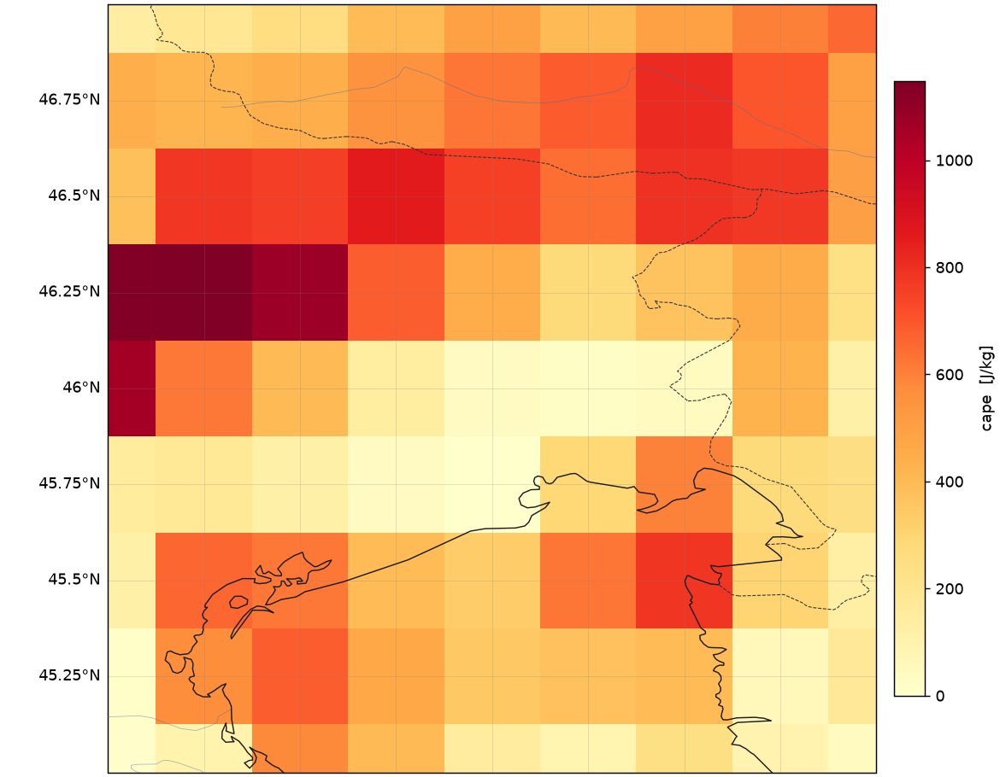
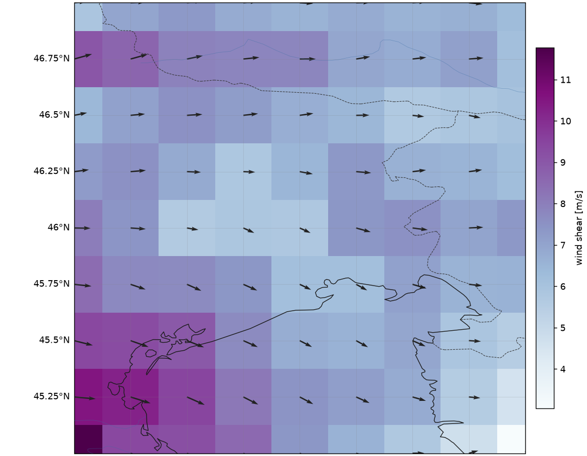
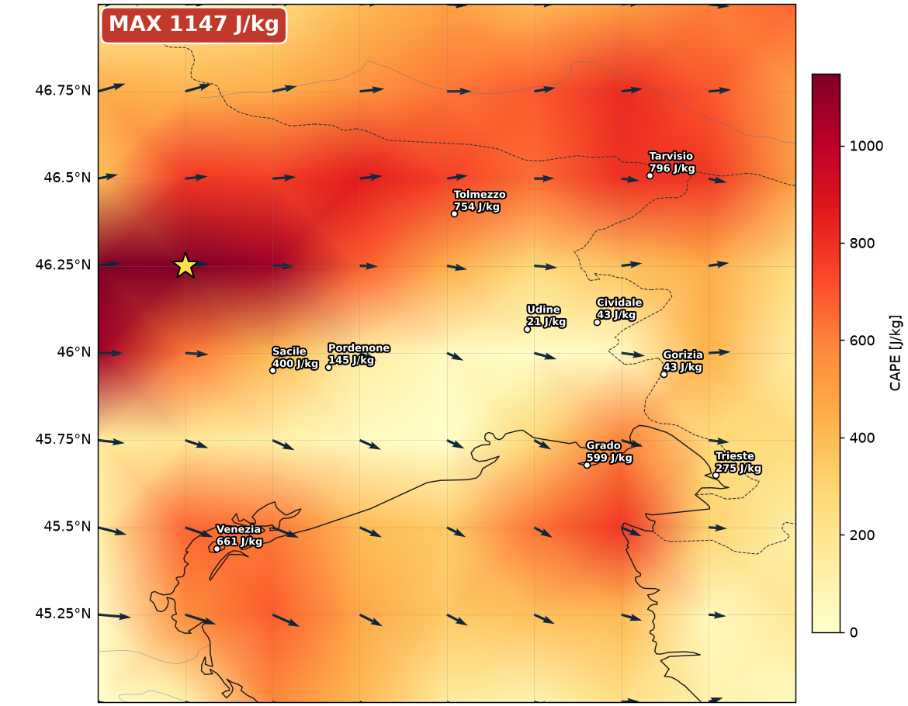
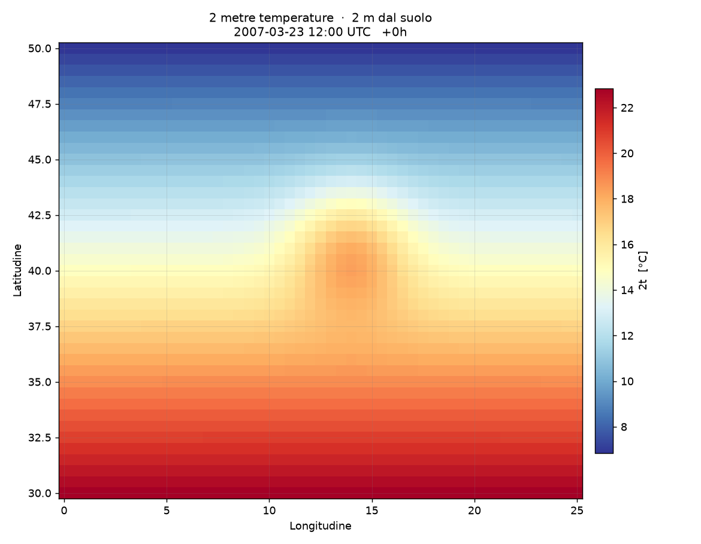
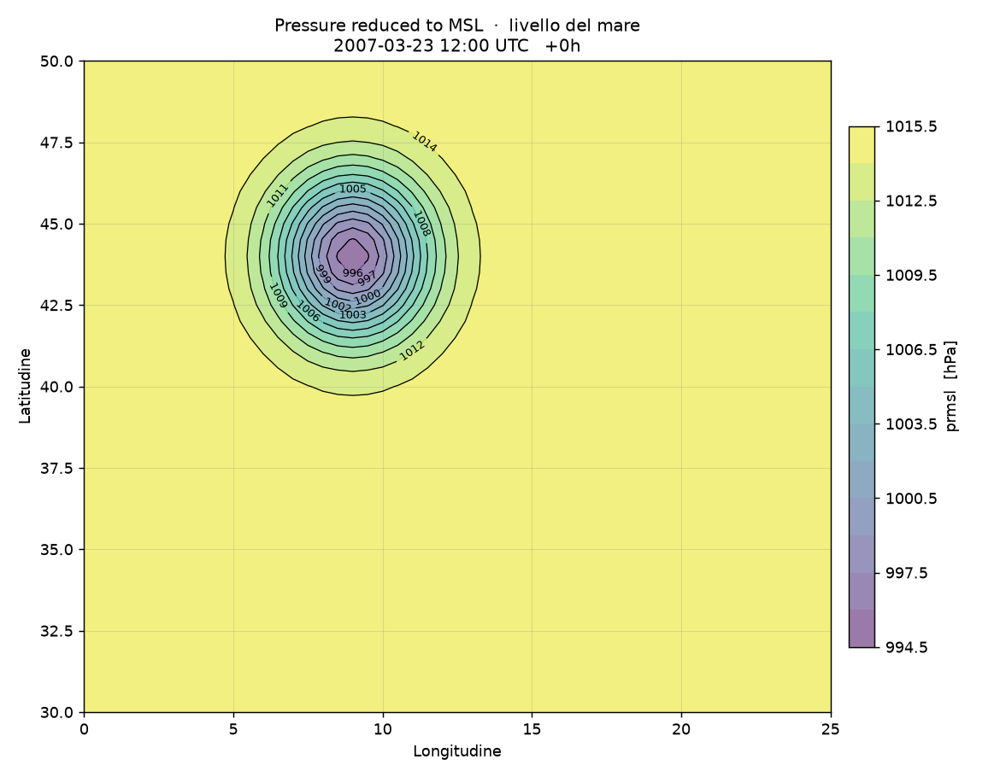
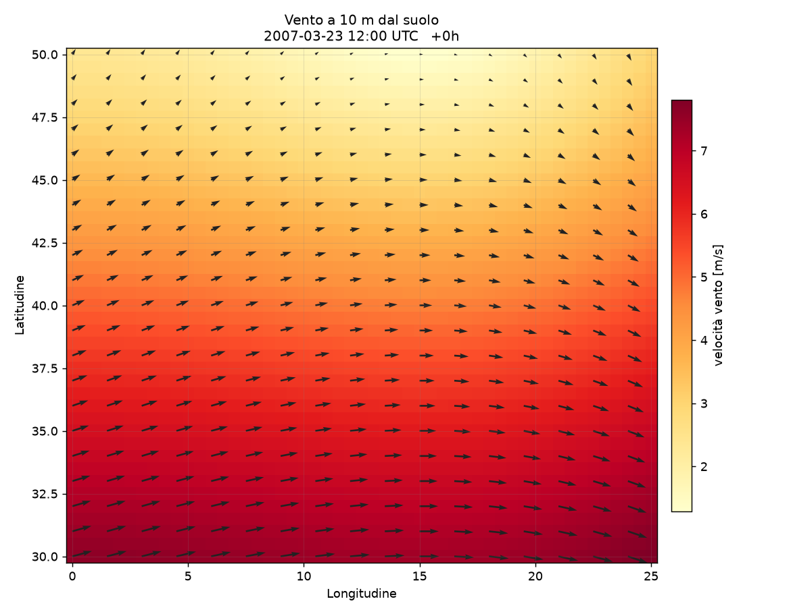

# 🌦️ MeteoGrib

<p align="center">
  
  
  
  
  
</p>

<p align="center">
  Un'alternativa a <strong>wgrib2</strong> che legge file meteo <strong>GRIB1/GRIB2</strong>
  (NOAA GFS, ECMWF, ICON, …) e ne fa <strong>inventario, mappe e grafici</strong>,<br/>
  scegliendo da solo il tipo di grafico giusto in base a cosa c'è dentro il file.
</p>

<p align="center">
  <em>Una creazione di <strong>Gimmy Pignolo &amp; Anthropic</strong> — nata perché su Windows
  mancano gestori GRIB semplici e nativi.</em>
</p>

> 🪟 **Cerchi la versione Windows con interfaccia grafica?** C'è un porting in
> **C++ nativo con GUI Win32 e soluzione Visual Studio** (apri il GRIB, mappa a
> schermo, opzioni, salva BMP/CSV, **auto-aggiornamento da GitHub**):
> vedi **[`cpp/README_CPP.md`](cpp/README_CPP.md)**.

---

## 🤔 Perché non wgrib2?

[wgrib2](https://www.cpc.ncep.noaa.gov/products/wesley/wgrib2/) è ottimo, ma è un
programma scritto in C che **su Windows gira solo con Cygwin** — un ambiente
scomodo da installare e configurare.

MeteoGrib fa il lavoro più comune (leggere e visualizzare i dati GRIB) usando la
libreria **ecCodes dell'ECMWF**, che si installa con un semplice `pip install` e
**porta con sé il binario già compilato, anche per Windows**. Niente Cygwin,
niente compilazione.

| | wgrib2 | MeteoGrib |
|---|---|---|
| Installazione su Windows | Cygwin + compilazione | `pip install -r requirements.txt` |
| Legge GRIB1 / GRIB2 | ✅ | ✅ |
| Inventario dei campi | ✅ (testo) | ✅ (testo, stile wgrib2) |
| Mappe pronte all'uso | ❌ (serve altro software) | ✅ (PNG + dashboard HTML) |
| Sceglie il grafico giusto da solo | ❌ | ✅ (temperatura, pressione, vento, pioggia…) |
| Export CSV | parziale | ✅ |

> MeteoGrib **non** rimpiazza wgrib2 al 100% (wgrib2 fa anche interpolazioni,
> ri-grigliature, conversioni avanzate). Copre il caso d'uso più frequente:
> *«ho un file GRIB, cosa c'è dentro e come lo visualizzo?»*.

---

## 🚀 Installazione

```bash
cd Projects/coded/MeteoGrib
pip install -r requirements.txt
```

Su Windows funziona esattamente allo stesso modo, dal Prompt dei comandi o da
PowerShell — **senza Cygwin**.

---

## 🛠️ Uso

### 1. Inventario — cosa c'è nel file (come `wgrib2 file`)

```bash
python meteogrib.py info file.grib2
python meteogrib.py info file.grib2 -l      # dettagli estesi (min/media/max, griglia)
```

```
1:GRIB2:d=2007032312:2t:2 m dal suolo:step 0
2:GRIB2:d=2007032312:prmsl:livello del mare:step 0
3:GRIB2:d=2007032312:10u:10 m dal suolo:step 0
4:GRIB2:d=2007032312:10v:10 m dal suolo:step 0
5:GRIB2:d=2007032312:tp:superficie:step 0
```

### 2. Auto — analizza tutto e genera una cartella di grafici + dashboard

```bash
python meteogrib.py auto file.grib2 --outdir grafici
```

MeteoGrib riconosce i campi e produce il grafico **adatto a ciascuno**:

- 🌡️ **temperatura** → mappa a colori (rosso/blu), convertita in °C
- 🎈 **pressione al livello del mare** → carta con **isobare etichettate**
- 💨 **vento** (unisce le componenti U e V) → velocità a colori + **frecce**
- 🌧️ **precipitazione** → mappa in scala di blu (mm)
- ⚡ **CAPE / CIN** → mappa dell'energia convettiva (instabilità temporali)
- 💧 umidità, ☁️ nuvolosità, e altro → mappa a colori adeguata

**Prodotti derivati** (calcolati in automatico quando i dati lo permettono):

- 🌀 **Wind shear** — se il file ha il vento a due quote (es. 500 hPa e 10 m),
  MeteoGrib calcola lo *shear* (vento in quota − vento al suolo): ingrediente
  chiave per i temporali organizzati.
- ⛈️ **Carta "ingredienti temporali"** — CAPE ombreggiata + frecce di shear
  sovrapposte, la vista che usano i previsori per il rischio temporali.
- 🧭 **Giudizio automatico** — una riga di sintesi su CAPE e shear massimi con
  una stima qualitativa del potenziale temporali *(indicativo, non una
  previsione ufficiale)*.

Alla fine apri `grafici/index.html`: un cruscotto che raccoglie tutte le mappe,
il giudizio e l'inventario completo.

Se hai installato **cartopy** (vedi sotto), tutte le mappe hanno in sottofondo
**coste, confini nazionali e fiumi** ad alta risoluzione — indispensabile per
inquadrare regioni piccole come il Friuli Venezia Giulia.

### 3. Plot — un singolo campo

```bash
python meteogrib.py plot file.grib2 --index 2 --out pressione.png
python meteogrib.py plot file.grib2 --var 2t --out temperatura.png
```

### 4. Export — i dati in CSV (per Excel, ecc.)

```bash
python meteogrib.py export file.grib2 --var 2t --out temperatura.csv
```

```
# 2 metre temperature [K] · 2 m dal suolo · step 0
lat,lon,valore
50.0000,0.0000,280.1
...
```

---

## 🖼️ Esempi

### Caso reale: CAPE sul Friuli Venezia Giulia (con sfondo cartopy)

Da `examples/FVG_CAPE_20260809.grib2` — una previsione con CAPE e vento a due
quote. Prova con: `python meteogrib.py auto examples/FVG_CAPE_20260809.grib2 --outdir grafici`

| CAPE (energia temporali) | Wind shear 500 hPa − 10 m | Ingredienti temporali (CAPE + shear) |
|---|---|---|
|  |  |  |

Si vedono la costa adriatica, la laguna di Grado/Marano e i confini con Slovenia
e Austria (tratteggiati). Giudizio automatico prodotto su questo file:

> ⚡ CAPE max ≈ 1147 J/kg (instabilità forte); shear max ≈ 12 m/s (shear moderato
> → temporali organizzati/multicellulari). **Potenziale temporali: MODERATO.**
> *(indicativo, non una previsione ufficiale)*

### Campi base (dal file di test `examples/sample.grib2`)

| Temperatura a 2 m | Pressione (isobare) | Vento a 10 m |
|---|---|---|
|  |  |  |

---

## 🌍 Coste e confini sulle mappe (cartopy)

Le coste, i confini nazionali e i fiumi in sottofondo alle mappe li fornisce
**cartopy**, già incluso in `requirements.txt`. La prima volta cartopy scarica
da solo i file cartografici (Natural Earth) e li mette in cache.

Se preferisci un'installazione minima puoi ometterlo: MeteoGrib lo rileva da
solo e, quando manca, ripiega su una griglia lat/lon pulita senza dare errori.

```bash
pip install cartopy      # se hai saltato requirements.txt
```

> Nota: la prima mappa con cartopy richiede connessione a Internet per scaricare
> la cartografia; dopo funziona anche offline.

---

## 📂 Dove trovare file GRIB reali

- **NOAA GFS** (globale, gratuito): <https://nomads.ncep.noaa.gov/>
- **ECMWF Open Data**: <https://data.ecmwf.int/forecasts/>
- **DWD ICON** (Germania/Europa): <https://opendata.dwd.de/>

Scarica un file `.grib2` e provalo con `python meteogrib.py auto tuofile.grib2`.

---

## 🧩 Come funziona (in breve)

1. **ecCodes** apre il file e scorre i messaggi GRIB uno per uno.
2. Per ogni messaggio MeteoGrib legge nome, unità, livello, data/scadenza,
   griglia geografica e valori.
3. Da `(discipline, category, number)` — le coordinate standard WMO del
   parametro — capisce *che grandezza è* e sceglie palette e tipo di grafico.
4. **matplotlib** disegna la mappa; le immagini vengono raccolte in un
   `index.html`.

---

<p align="center">
  parte del progetto <strong>SISMO ECHO</strong> · Gimmy Pignolo © 2026 · tutti i diritti riservati (vedi <a href="../../../LICENSE">LICENSE</a>)<br/>
  dati GRIB via <a href="https://confluence.ecmwf.int/display/ECC">ecCodes</a> (ECMWF) ·
  ispirato a <a href="https://www.cpc.ncep.noaa.gov/products/wesley/wgrib2/">wgrib2</a> (NOAA)
</p>
