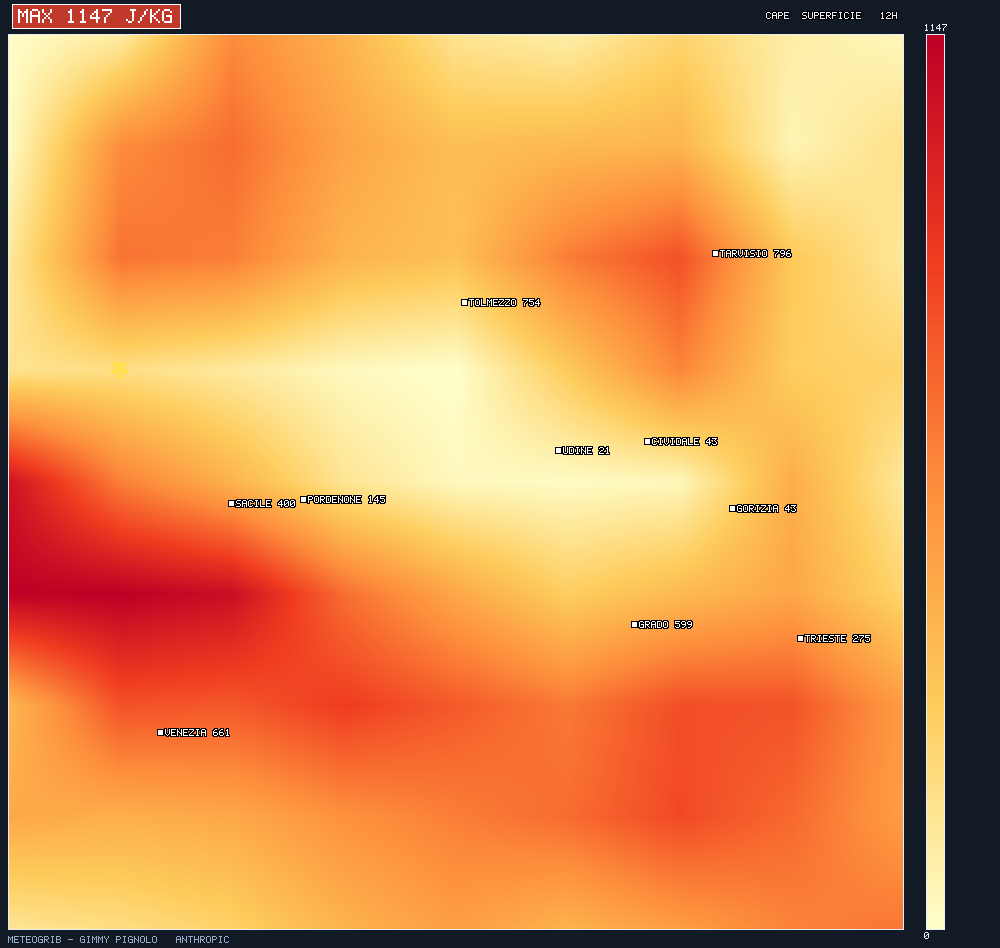

# 🪟 MeteoGrib — porting C++ per Windows

<p align="center">
  
  
  
  
</p>

Porting in **C++ nativo** del cuore di MeteoGrib: legge file **GRIB1/GRIB2** con
la libreria **ecCodes** e produce inventario, **heatmap** (immagini BMP con città
e valori) ed export CSV — con una **soluzione Visual Studio** pronta
(`MeteoGrib.sln`) e una **GUI minimale Win32** per aprire i file e gestire le
opzioni.

## 🧩 Cosa contiene la soluzione

| Progetto | Tipo | Cosa fa |
|---|---|---|
| **MeteoGribCli** | console | `info` / `plot` / `export` / `auto` da riga di comando |
| **MeteoGribGui** | finestra Win32 | apri GRIB, lista campi, mappa a schermo, opzioni, salva BMP/CSV |

Motore condiviso (header-only dove possibile):
`grib_reader` (lettura ecCodes) · `render` (heatmap+città+badge) · `bmp`
(immagine RGB, font 5×7 integrato, colormap, scrittura BMP).

> ⚠️ **Limite dichiarato:** questo porting C++ **non disegna le coste/confini** —
> quella è la funzione `cartopy` della versione Python, che resta la più
> completa (carte derivate, wind shear, coste FVG). Il C++ disegna griglia,
> città con valori, colorbar e badge del massimo, **senza dipendenze grafiche
> esterne** (nessun Qt/GDI+ per l'immagine: solo Win32 per la finestra).

## ✅ Prerequisiti

1. **Visual Studio 2022** con il workload *“Sviluppo di applicazioni desktop con C++”*.
2. **ecCodes** per Windows. Il modo più semplice è **vcpkg**:

```bat
git clone https://github.com/microsoft/vcpkg
cd vcpkg && bootstrap-vcpkg.bat
vcpkg install eccodes:x64-windows
vcpkg integrate install
```

## 🔧 Configurazione del percorso ecCodes

I due progetti cercano ecCodes nella variabile d'ambiente **`ECCODES_DIR`**.
Impostala (una volta) alla cartella di installazione di vcpkg, per esempio:

```bat
setx ECCODES_DIR C:\dev\vcpkg\installed\x64-windows
```

Struttura attesa: `%ECCODES_DIR%\include\eccodes.h`, `%ECCODES_DIR%\lib\eccodes.lib`,
`%ECCODES_DIR%\bin\eccodes.dll`. (Con `vcpkg integrate install` le DLL vengono
copiate automaticamente accanto all'eseguibile; altrimenti aggiungi
`%ECCODES_DIR%\bin` al `PATH` o copia `eccodes.dll` nella cartella `build\...`.)

## 🏗️ Compilazione

1. Apri **`MeteoGrib.sln`** in Visual Studio 2022.
2. Seleziona **x64** e **Release** (o Debug).
3. **Compila soluzione** (Ctrl+Shift+B).

Gli eseguibili finiscono in `build\x64\Release\` (`MeteoGribCli.exe`,
`MeteoGribGui.exe`).

## ▶️ Uso

### GUI
Avvia **MeteoGribGui.exe**, premi **“Apri GRIB…”**, scegli il file. A sinistra
compare la lista dei campi: cliccane uno per vederne la mappa. Le caselle
**Mostra città / Badge del massimo / Griglia** aggiornano la mappa in tempo
reale. **Salva BMP…** e **Esporta CSV** salvano il campo corrente.

Esempio di output del porting C++ (heatmap BMP nativa, con città, valori,
badge del massimo e footer di credito):



### CLI
```bat
MeteoGribCli.exe info    file.grib2
MeteoGribCli.exe plot    file.grib2 --index 5 --out cape.bmp
MeteoGribCli.exe export  file.grib2 --index 5 --out cape.csv
MeteoGribCli.exe auto    file.grib2 --outdir mappe
```
Opzioni di `plot`: `--no-cities`, `--no-max`.

## 🐧 Build su Linux/macOS (per test)

La sola CLI si compila anche fuori da Windows:

```bash
ECCODES_DIR=/percorso/eccodes ./build_linux.sh
./meteogrib_cli info file.grib2
```

*(La GUI è Win32-only: fuori da Windows il file `meteogrib_gui.cpp` si riduce a
uno stub vuoto e non viene usato.)*

## 🔄 Versione e aggiornamento automatico

La GUI mostra la **versione** (attuale: `1.0.0`) nel titolo, nel pannello e in
**Info / Crediti**. Il pulsante **“Aggiornamento”** (e un controllo silenzioso
all'avvio) interroga le **GitHub Releases** del repository
`gmy77/sismo-echo`: se esiste un tag più recente, la GUI propone di scaricare il
nuovo `.exe` e si **auto-sostituisce** (scarica in `%TEMP%`, un piccolo `.bat`
rimpiazza l'eseguibile e riavvia). Tutto tramite **WinINet** (incluso in
Windows), senza librerie esterne.

### Come pubblicare una nuova versione (per l'autore)

1. Alza `APP_VERSION` in `src/meteogrib_gui.cpp` (es. `1.1.0`) e ricompila.
2. Crea una **Release** su GitHub con tag tipo `v1.1.0`.
3. Allega come **asset** l'eseguibile con estensione **`.exe`**
   (es. `MeteoGribGui.exe`).

Da quel momento chi ha una versione precedente vede l'aggiornamento e lo installa
con un clic. Il confronto è numerico su `MAJOR.MINOR.PATCH`, quindi il tag può
essere `v1.1.0`, `meteogrib-1.1.0`, ecc.

> Nota: l'auto-sostituzione funziona sull'eseguibile installato dall'utente; se
> l'app è in una cartella protetta (es. `C:\Program Files`), avviala come
> amministratore o installala in una cartella utente.

---

<p align="center">
  <strong>MeteoGrib per Windows — una creazione di Gimmy Pignolo &amp; Anthropic</strong><br/>
  nato perché su Windows mancano gestori GRIB semplici e nativi.<br/>
  parte del progetto <strong>SISMO ECHO</strong> · © 2026 Gimmy Pignolo · tutti i diritti riservati<br/>
  lettura GRIB via <a href="https://confluence.ecmwf.int/display/ECC">ecCodes</a> (ECMWF)
</p>
